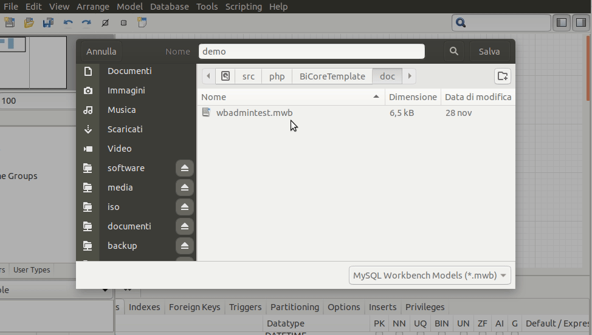
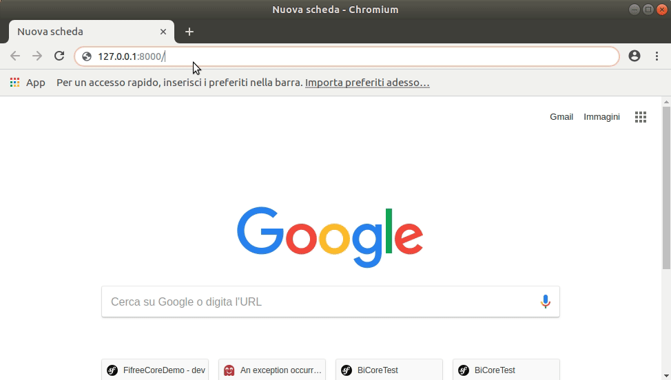
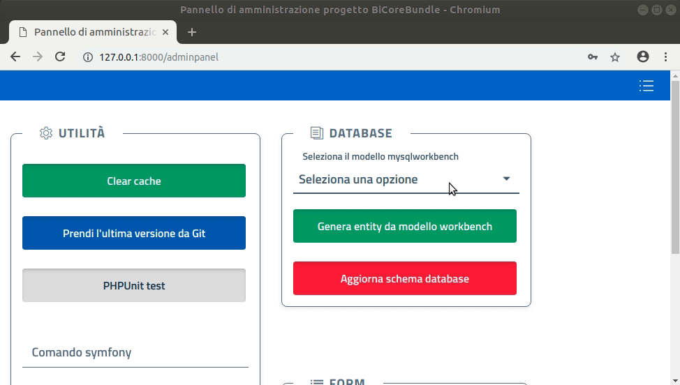
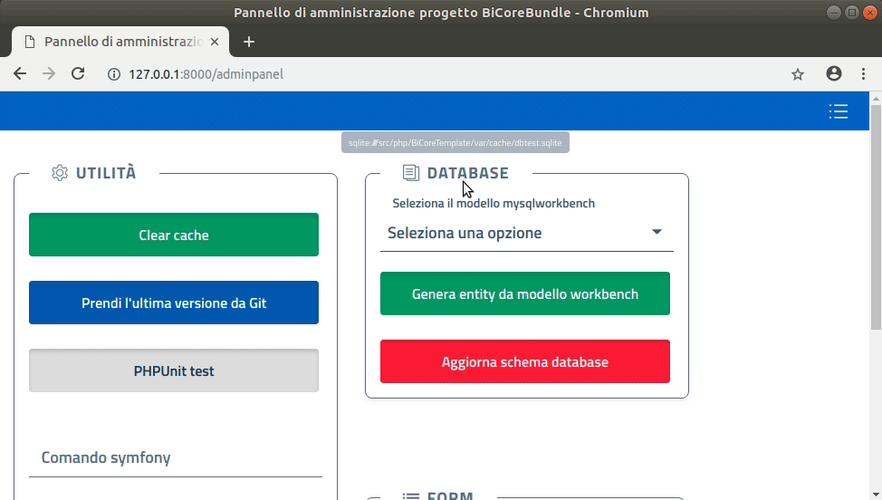
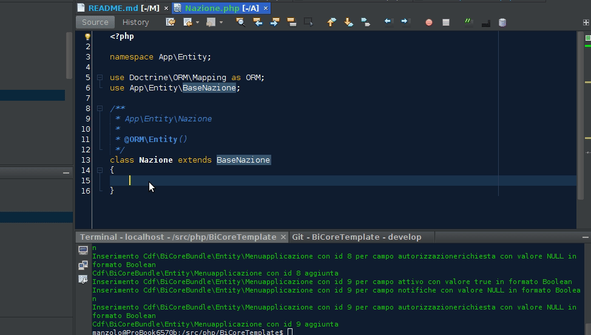
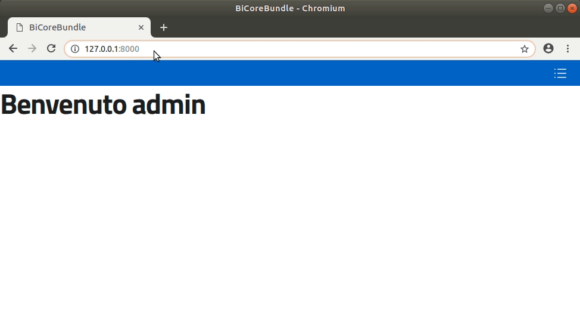
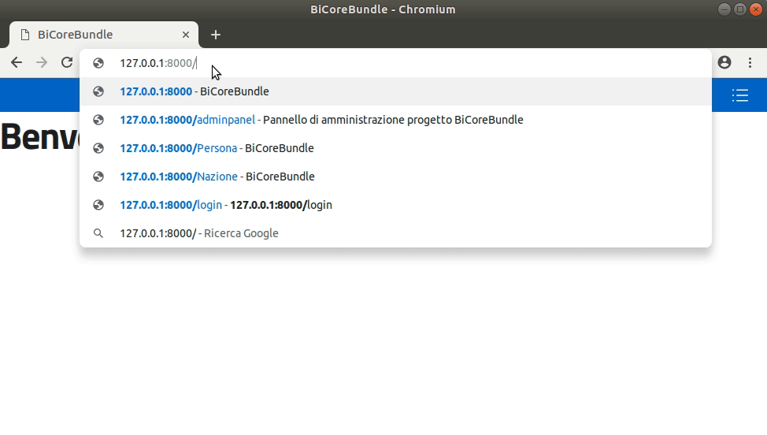
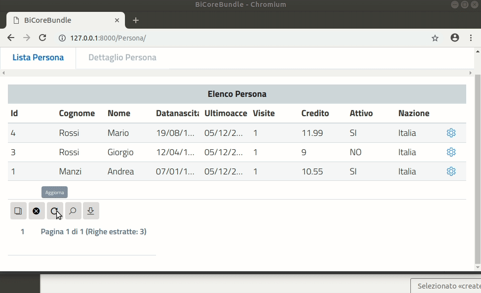

[](https://travis-ci.org/ComuneFI/BiCoreTemplate)

# BiCoreTemplate

> ⚠️ **WORK IN PROGRESS** ⚠️

## Intro

BiCoreTemplate è un template pronto all'uso che si poggia sul <a href="https://github.com/ComuneFI/BiCoreBundle" target="_blank">bundle</a> BiCoreBundle 

## Per iniziare

**NOTA**: richiede PHP 7.2.

### Prerequisiti

Testato su Debian next stable 10 (buster).

```sh
sudo apt install php-sqlite3 php-xml php-gd php-curl php-mbstring php-zip composer git
```

### Configurazione

Se necessario, modificare il file `.env` per impostare il database da utilizzare.
Di base usa sqlite3, se si cambia database è necessario installare il driver PHP corrispondente.

### Installazione

```
git clone https://github.com/ComuneFi/BiCoreTemplate.git
cd BiCoreTemplate
composer install
bin/console cache:clear
bin/console bicorebundle:dropdatabase --force
bin/console bicorebundle:install admin admin admin@admin.it
```

### Utilizzo

Avviare il server col comando:
```
bin/console server:start
```
oppure:
```
bin/console server:start 0.0.0.0:8000
```
se è installato in un container/docker e si desidera accedervi dall'host.

Visitare: http://127.0.0.1:8000/ ed effettuare il login (admin/admin).

Il server rimane attivo in background. Per arrestarlo:
```
bin/console server:stop
```

### Demo

* Creare un file modello workbench nella cartella doc (es demo.mwb):



* Visitare: http://127.0.0.1:8000/adminpanel ed effettuare il login (admin/admin):




* Creare le entità per il modello workbench e aggiornare il database con le nuove entità:



* Ricaricare la pagina e creare le forms per il C.R.U.D. :



* Nel file src/Entity/Nazione.php generato dal pannello di amministrazione creare la funzione:
```
    public function __toString()
    {
        return $this->getDescrizione();
    }

```


* Visitare: http://127.0.0.1:8000/Nazione per aggiungere le nazioni:


* Modificare la form di Persona per migliorarla in src/Form/Persona.php come nell'esempio:
```
<?php

namespace App\Form;

use App\Entity\Persona;
use Symfony\Component\Form\AbstractType;
use Symfony\Component\Form\FormBuilderInterface;
use Symfony\Component\OptionsResolver\OptionsResolver;
use Symfony\Component\Form\Extension\Core\Type\SubmitType;
use Symfony\Component\Form\Extension\Core\Type\DateTimeType;
use Symfony\Component\Form\Extension\Core\Type\NumberType;

class PersonaType extends AbstractType
{
    public function buildForm(FormBuilderInterface $builder, array $options)
    {
        $submitparms = array('label' => 'Salva', 'attr' => array("class" => "btn-outline-primary bisubmit"));
        $builder
                ->add('nazione')
                ->add('cognome')
                ->add('nome')
                ->add('datanascita', DateTimeType::class, array(
                    'widget' => 'single_text',
                    'format' => 'dd/MM/yyyy',
                    "attr" => array("class" => "bidatepicker")
                ))
                ->add('ultimoaccesso', DateTimeType::class, array(
                    'widget' => 'single_text',
                    'format' => 'dd/MM/yyyy HH:mm',
                    "attr" => array("class" => "bidatetimepicker")
                ))
                ->add('visite', NumberType::class)
                ->add('credito', NumberType::class)
                ->add('attivo')
                ->add('submit', SubmitType::class, $submitparms)
        ;
    }
    public function configureOptions(OptionsResolver $resolver)
    {
        $resolver->setDefaults([
            'data_class' => Persona::class,
            'parametriform' => array()
        ]);
    }
}

```

* Visitare: http://127.0.0.1:8000/Persona per aggiungere le persone:



* Visitare: http://127.0.0.1:8000/Persona per provare le funzioni base di interfaccia:

